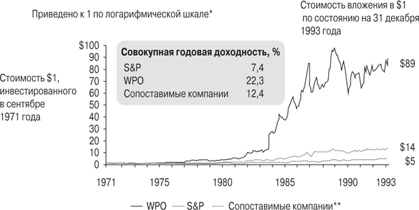
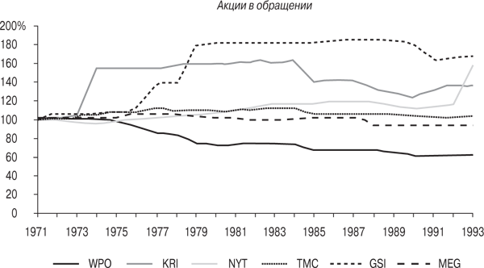

# Глава 5. Кэтрин Грэм и The Washington Post Company

Глава 5

Вдова встает у руля компании

*Кэтрин Грэм и The Washington Post Company*

Учреждение и поддержание нетрадиционного \[подхода\] зачастую подразумевает то, что вы выглядите совершенно неблагоразумным в глазах общественности.

Дэвид Свенсен, главный директор по инвестициям, Фонд Йельского университета

Путь Кэтрин Грэм к должности президента и СЕО The Washington Post Company был крайне необычным. Дочь видного финансиста (и владельца Washington Post) Юджина Мейера, она выросла в привилегированной среде (с прислугой, закрытыми школами, загородными домами и путешествиями по миру). В 1940 году Кэтрин вышла замуж за Филиппа Грэма, блестящего юриста -- выпускника Гарварда и протеже судьи Верховного суда Феликса Франкфуртера. В 1946 году Мейер предложил Грэму управлять компанией, с чем тот с переменным успехом справлялся вплоть до своей внезапной смерти -- самоубийства в 1963 году. После трагической смерти мужа Кэтрин неожиданно обнаружила в себе интерес к семейному бизнесу и решила возглавить его.

Не будет преувеличением сказать, что Грэм была абсолютна не подготовлена к этой роли. Она, 46-летняя мать четверых детей, не работала с момента рождения первого ребенка -- то есть почти 20 лет. А после неожиданной смерти Фила вдруг оказалась единственной женщиной -- руководителем бизнеса уровня компаний из списка Fortune 500. Естественно, поначалу это повергло ее в шок. История Кэтрин Грэм широко известна и лучше всего рассказана в ее автобиографии Personal History («Личная история»), опубликованной в 1997 году и получившей Пулитцеровскую премию.

В меньшей степени говорилось о том, что сделала Грэм для акционеров. С момента IPO в 1971 году и до ухода Грэм в отставку в 1993-м совокупная годовая доходность для акционеров достигла невероятных *22,3 %*, опередив индекс S&P *(7,4 %)* и конкурентов *(12,4 %)*. Доллар, вложенный в компанию при первичном размещении ее акций (IPO), стоил *89 долларов* к тому времени, когда Грэм ушла в отставку. Для сравнения, за тот же период в среднем по отрасли этот показатель составил бы *14 долларов*, а в случае с S&P -- *5 долларов*. Как показано на рис. 5.1, Грэм обогнала индекс S&P в *18 раз*, а конкурентов -- более чем *в шесть раз*. Все 22 года руководства компанией она просто-напросто была лучшим управляющим в газетной индустрии страны, оставив всех далеко позади.

Когда Грэм стала президентом The Washington Post Company 20 сентября 1963 года (всего за два месяца до гибели ее друга Джона Кеннеди), она унаследовала компанию, сильно разросшуюся под руководством ее мужа Фила и владевшую портфелем медиаактивов, включая саму газету Washington Post (одну из трех основных газет на растущем рынке округа Колумбия), журнал Newsweek и три телеканала во Флориде и Техасе.

**Рис. 5.1.** Совокупная доходность для акционеров The Washington Post Company (WPO) при Грэм существенно превысила показатель S&P 500 и конкурентов. *Источник: Center for Research in Security Prices (CRSP)*

\* Скорректированный показатель с учетом дробления акций и выплаты дивидендов в денежной форме.

\*\* Сопоставимые компании включают Gannett Co., Knight Ridder, Media General, The New York Times Company и Times Mirror Company, взвешенные по рыночной капитализации.

Примечание. Для целей рисунка в качестве исходной точки руководства Грэм WPO принимаем не 1963 год, а 1971-й (когда компания стала публичной).

Следующие несколько лет Кэтрин постепенно привыкала к новой роли и знакомилась с бизнесом, советом директоров и менеджерами. В 1967 году она впервые заявила о себе, когда приняла первое важное кадровое решение, заменив главного редактора газеты Washington Post Расса Уиггинса на дерзкого 44-летнего Бена Брэдли, помощника редактора из Newsweek.

В 1971 году по рекомендации совета директоров Грэм решила сделать компанию публичной (посредством IPO), что позволило бы привлекать капитал для финансирования приобретений. За неделю до первичного размещения акций газета Washington Post оказалась вовлечена в скандал, связанный с секретными материалами Пентагона (так называемыми Pentagon Papers) о войне во Вьетнаме, которые показывали военное ведомство США далеко не в лучшем свете. К тому моменту New York Times уже имела судебный запрет на публикацию этих документов, а Грэм получила предупреждение от администрации Никсона о возможном отзыве лицензии на вещание в том случае, если она напечатает данные из Pentagon Papers. Это не только ставило под угрозу размещение акций компании, но и могло лишить ее одного из основных источников прибыли. Не получив внятной юридической поддержки, Грэм пришлось целиком и полностью положиться на себя, и она решила идти вперед. Материалы были опубликованы, благодаря чему Washington Post завоевала репутацию серьезного и уважаемого издания. Администрация Никсона не оспорила лицензии на вещание, а IPO компании прошло весьма успешно и принесло 16 млн долларов.

В 1972 году при поддержке Грэм Washington Post провела ряд журналистских расследований о нарушениях со стороны республиканцев в ходе предвыборной президентской кампании, в конечном счете переросших в Уотергейтский скандал. Брэдли и два молодых журналиста, Карл Бернстайн и Боб Вудворд, активно освещали это громкое дело на страницах издания, что в конце концов привело к отставке Ричарда Никсона летом 1974 года. Этот журналистский успех принес Washington Post Пулитцеровскую премию (одну из восемнадцати в бытность Брэдли главным редактором издания) и сделал газету единственным конкурентом New York Times. Проявления недовольства и угрозы со стороны администрации Никсона продолжались на протяжении всего Уотергейтского скандала, но Грэм решительно не обращала на них внимания.

Часть средств, полученных от IPO, Грэм направила на покупку Trenton Times -- газеты в Нью-Джерси, оказавшейся весьма посредственной. Она публиковалась ежедневно после обеда и входила в сегмент двухстраничных газет с высочайшим уровнем конкуренции. Из этого не самого удачного опыта Грэм вынесла ценный урок и в дальнейшем с большой осторожностью подходила к вопросу приобретений.

В 1974 году неизвестный инвестор начал скупать акции The Washington Post Company и в конце концов приобрел 13 %. Проигнорировав рекомендации совета директоров, Грэм встретилась с незнакомцем (им оказался Уоррен Баффет) и предложила ему стать членом совета. Вскоре Баффет превратился в ее бизнес-наставника и помог выбрать уникальный курс в управлении.

В 1975 году компания столкнулась с массовыми забастовками, которые возглавлял мощный союз журналистов; они начались с поджога бастующими типографии. Грэм, проконсультировавшись с Баффетом и остальными членами совета директоров, решила противостоять этим действиям. Пропустив всего один день публикации, они с Брэдли (и ее 27-летним сыном Дональдом) собрали костяк команды и выпускали газету 139 дней подряд, пока журналисты наконец не согласились пойти на существенные уступки.

Эта забастовка оказалась мучительным опытом для всех вовлеченных в нее людей (в какой-то момент один из пикетчиков был замечен в футболке с надписью «Фил застрелил не того из Грэмов»), но уступки, которых добилось руководство, ощутимо улучшили рентабельность Washington Post и стали поворотным моментом для всей индустрии: это был один из первых случаев, когда крупное издание смогло противостоять бастующим. Для Грэм это событие стало поворотной точкой, своего рода «бизнес-эквивалентом Уотергейта». С этого момента более ни у кого не возникало вопроса, кто главный в The Washington Post Company.

Именно в это время, после ряда консультаций с Баффетом, Грэм приняла еще одно неординарное решение -- начала активно скупать собственные акции (как в свое время Генри Синглтон и Том Мерфи). В течение следующих нескольких лет она выкупила почти 40 % акций компании по самой низкой цене. Показательно, что никто из крупных издателей не последовал ее примеру.

В 1981 году произошли два важных события. Во-первых, давний соперник Post -- газета Washington Star -- после нескольких лет сокращений тиража все-таки закрылась. Это сделало Washington Post, с ее экономной «постзабастовочной» структурой расходов, монополистом на рынке ежедневных столичных газет, что привело к существенному увеличению тиража и рентабельности, и так продолжалось в течение десяти лет.

Во-вторых, после предпринятых в 1970-е годы четырех неудачных попыток Грэм наконец нашла сильного исполнительного директора в лице Дика Симмонса. После прихода в компанию Симмонс, ранее работавший в Dun & Bradstreet (другом многоотраслевом медиахолдинге), сразу же принялся за модернизацию процессов в тех подразделениях, которые показывали меньшую относительную прибыльность. Это положило начало новой эры существенного роста рентабельности компании и подчеркнуло важную роль, которую играли в успехе СЕО-аутсайдеров эффективные управленцы, бравшие на себя решение операционных вопросов.

Симмонс привнес в компанию свой талант руководителя и при поддержке Грэм избавился от газеты Trenton, изменил систему вознаграждений, сделав акцент на бонусной составляющей, и настойчиво требовал от сотрудников опережения конкурентов по динамике и результатам. За несколько лет рентабельность газет и телеканалов компании увеличилась почти вдвое, что обеспечило стремительный рост прибыльности бизнеса.

Пик в заключении сделок в газетной индустрии пришелся на 1980-е годы. Цены взлетели до небес на фоне увеличения прибылей и коэффициентов стоимости. И только Грэм оставалась в стороне. The Washington Post Company внимательно рассматривала многие варианты сделок, включая крупные газеты в Айове, Техасе и Кентукки, но сделала только два приобретения, и оба -- небольшие. Важно понимать, сколь необычным казалось такое сдержанное поведение в тепличном климате с середины до конца 1980-х годов. Это был «путь одиночки», который вызывал массу комментариев со стороны коллег и прессы. Положение усугублялось еще и тем, что Грэм была единственной женщиной-руководителем в довольно закрытой индустрии, где доминировали мужчины.

Следует отметить, что бóльшая часть приобретений The Washington Post Company под управлением Грэм приведет компанию в новые сферы бизнеса, не связанные с издательским делом и телевещанием. В 1983 году один из новых нанятых Симмонсом сотрудников Алан Спун, ранее работавший консультантом по вопросам управления, провел глубокое изучение рынка, после чего компания удачно вышла в сегмент сотовых телефонов. Она купила франшизы на рынках шести крупных городов, включая Детройт, Вашингтон и Майами, за 29 млн долларов. В 1984 году The Washington Post Company приобрела бизнес Стенли Каплана по подготовке к прохождению тестов и сдаче экзаменов, обеспечив себе тем самым неплохие позиции в сфере образования. Наконец, в 1986 году Грэм благодаря своевременной рекомендации Баффета сделала свое самое большое приобретение: купила системы кабельного телевидения Capital Cities за 350 млн долларов. Каждое из этих направлений в дальнейшем сыграет важную роль для компании.

В начале 1988 года, когда оценки стоимости повсеместно росли, Грэм решила продать принадлежавшие ей активы в секторе телефонии, поскольку для разработки систем сотовой связи требовались большие капиталовложения. Эта сделка принесла ей 197 млн долларов, обеспечив исключительную доходность инвестиций.

В период экономического спада в начале 1990-х, когда обремененные долгами конкуренты были вынуждены отойти в сторону, The Washington Post Company стала в нехарактерной для себя манере скупать другие компании. Пользуясь резким падением цен, она приобрела системы кабельного телевидения, недостаточно успешные телеканалы и несколько образовательных бизнесов.

Когда Грэм покидала свой пост председателя совета директоров в 1993 году, The Washington Post Company была самой многопрофильной среди всех представителей отрасли, получая почти половину выручки и прибыли от активов, не связанных с издательской деятельностью. Такая диверсификация позволит компании и в дальнейшем динамично развиваться под руководством сына Кэтрин -- Дональда.

Грэм великолепно справилась с работой, доставшейся ей по наследству, что нечасто бывает в семейном бизнесе. С конца 1980-х она начала готовить следующее поколение лидеров компании, включая Дональда, который заменил ее на посту СЕО в 1991 году, а также Алана Спуна, который стал СОО вместо своего наставника Дика Симмонса в том же 1991-м. Когда Грэм ушла в отставку в возрасте 76 лет, талантливые молодые менеджеры взяли на себя руководящую роль в важнейших подразделениях компании -- кабельном телевидении (Том Майт) и образовании (Джонатан Грейер). Их талант и лидерские качества позволили The Washington Post Company следующие 15 лет стабильно опережать конкурентов.

Основные слагаемые успеха

Грэм под опекой Баффета оказалась эффективным, даже, можно сказать, уникальным специалистом по распределению активов. Ее подход к этому вопросу характеризовался низким для индустрии уровнем дивидендов и заимствований, значительным обратным выкупом акций, относительно редкими приобретениями и осторожным подходом к капиталовложениям. Давайте рассмотрим эти сферы и начнем с источников капитала компании.

Во время правления Грэм The Washington Post Company неизменно генерировала солидный денежный поток, а в 1980-е годы ее рентабельность существенно возросла, поскольку после закрытия газеты Star выручка стабилизировалась, а Дик Симмонс добился увеличения рентабельности во всех подразделениях. В дополнение к потоку денежных средств у компании были еще два источника финансирования, хотя оба они редко задействовались, -- займы и продажа активов.

Грэм, как правило, с осторожностью подходила к использованию заемных средств, а The Washington Post Company имела наиболее консервативный бухгалтерский баланс среди издателей. Грэм привлекла значительное долговое финансирование только один раз -- при покупке системы кабельного телевидения Capital Cities в 1986 году. При этом солидный денежный поток компании Грэм позволил погасить бóльшую часть этой долговой нагрузки менее чем за три года.

The Washington Post Company при Грэм, как и Berkshire Баффета, редко продавала действующий бизнес и воздерживалась от отделения компаний, предпочитая долгосрочную модель непосредственного владения. Компания сделала одно-единственное исключение из этих правил в начале 1988 года, когда решила продать свои активы сотовой связи, получив при этом исключительный доход от инвестиций.

Грэм распределяла деньги очень осторожно. Во время руководства компанией она поддерживала минимальный уровень дивидендов, считая, что они неэффективны с точки зрения налогообложения. Опять же стоит подчеркнуть обратную сторону этого подхода, особенно в газетной индустрии, где у семей-основателей (многие члены которых обычно зависели от дивидендных доходов) была большая доля собственности. The Washington Post Company при Грэм стабильно платила самые низкие дивиденды по сравнению с большинством конкурентов, поэтому у нее была самая высокая нераспределенная прибыль.

При распределении ее Грэм советовалась с Симмонсом, Баффетом и еще одним директором -- Дэном Берком из Capital Cities. Все решения о капиталовложениях проходили строгий отбор, критерием которого были солидные доходы от инвестированного капитала. Как говорил Алан Спун: «Система находилась полностью в федеральном подчинении, и все избыточные денежные средства направлялись в головной офис. Менеджеры должны были аргументировать все программы капиталовложений. Главный вопрос формулировался так: как лучше использовать каждый следующий доллар? И компания проявляла строгость и скептицизм при ответе на него».

Такая дисциплина научила Грэм аккуратно относиться к инвестициям. В 1980-е годы многие крупные издательства тратили сотни миллионов долларов на установку нового оборудования для печати и допечатной подготовки, позволяющего сократить срок поставки продукции и делать цветную печать. Грэм, единственная среди СЕО, воздерживалась от этого и была последней среди основных игроков, кто использовал старомодную типографскую печать. Она откладывала дорогие инвестиции в новое оборудование до тех пор, пока расходы на него не сократились, а его преимущества не были доказаны на опыте конкурентов.

Подход Грэм к приобретениям характеризовался двумя аспектами -- терпение и диверсификация. Годы ее руководства компанией, начиная с момента IPO, были отмечены ростом прибыли и оценочных коэффициентов, хотя за этот период и было два серьезных спада -- в середине 1970-х и в начале 1990-х. Иными словами, *стоимость* медийных активов сильно колебалась в те времена, когда Грэм была у руля компании, но она проявила себя в этих условиях как дальновидный штурман.

Уровень активности Грэм был зеркальным отражением макроэкономической ситуации, с двумя большими периодами обратного выкупа акций и приобретений (в начале и конце ее карьеры), прервавшими долгий период бездействия, на долю которого приходится бóльшая часть срока ее руководства компанией.

Вместе с советом директоров Кэтрин подвергала строгой аналитической проверке все потенциальные сделки. Как кратко сформулировал Том Майт: «Приобретения должны были приносить минимум 11 % денежного дохода за десятилетний период владения данным активом без привлечения заемных средств». Этот вроде бы простой тест оказался весьма эффективным фильтром, но, как говорит Майт: «Очень мало сделок прошло через это сито. Все приобретения компании подчинялись одному правилу: ждать нужной сделки».

Как мы уже говорили, во время бума на заключение сделок в 1980-е годы Грэм предпочитала оставаться в стороне от этого процесса. Как говорит сегодня ее сын Дональд: «Если компания не заключала тогда сделок, значит, они были не очень важными. Еще одна крупная газета могла стать якорной цепью на нашей шее сегодня». Единственная инвестиция в газетный бизнес, которую The Washington Post Company сделала за эти десять лет, была весьма основательной -- покупка миноритарного пакета в Cowles Media, издателе газеты Minneapolis Star Tribune и нескольких небольших ежедневных газет. Эти акции были приобретены вне аукциона по привлекательной цене благодаря долгим отношениям между семьями Грэм и Каулес.

Баффет сыграл в этом направлении ключевую роль, став высшей инстанцией для Грэм в вопросах распределения денежных средств. Он взвешивал все важные решения, включая капиталовложения, а особо активное участие принимал в поглощениях. При этом Баффет не давал прямых указаний. По словам давнего члена совета директоров и партнера компании Cravath, Swaine Джорджа Джиллеспи: «Он никогда бы не сказал "Не делай этого", но иногда более тонко, между строк, намекал: "Я, наверное, не стал бы этого делать по таким-то причинам, но поддержу тебя в любом твоем решении". Его аргументация, однако, была неизменно убедительной и, как правило, побуждала быть сдержанным».

Бóльшая часть поглощений The Washington Post Company под руководством Грэм привела компанию в новые сферы бизнеса, где конкуренция была не столь интенсивна, а оценки стоимости более разумны. Самыми значимыми среди таких покупок было приобретение бизнеса по подготовке к тестам и экзаменам Стенли Каплана, позволившее выйти на рынок образовательных услуг, и крупная сделка 1986 года по покупке компании Capital Cities, ставшая для Грэм отправной точкой в стремительно растущем бизнесе кабельного телевидения.

Сделка с Capital Cities была крупной и совершенно незапланированной и, как и сделка с Cowles, подчеркнула дисциплинированный подход Грэм к поглощениям. Когда Федеральное агентство по связи вынудило Capital Cities избавиться от систем кабельного телевидения после приобретения ABC, Уоррен Баффет договорился об эксклюзивном коммерческом предложении для The Washington Post Company. Грэм увидела большой потенциал у этого направления бизнеса, и, быстро проанализировав ситуацию, она и ее команда согласились приобрести системы кабельного телевидения за привлекательную цену -- 1000 долларов в расчете на абонента. Важно отметить, что в сделке не участвовал ни один инвестиционный банкир.

Не свойственная Грэм покупательская активность, проявившаяся в период экономического спада в начале 1990-х, оказалась столь же показательной. Имея исключительно сильный бухгалтерский баланс, она стала активным покупателем, тогда как обремененные долгами конкуренты не могли себе этого позволить. Используя преимущества заметного снижения цен, The Washington Post Company выгодно купила несколько кабельных систем, ряд не самых успешных телеканалов в Техасе и образовательных компаний. Все эти приобретения оказались чрезвычайно выгодными для акционеров.

Обратные выкупы акций были еще одной важной статьей расходов для Грэм в распределении капитала. Как только Баффет показал убедительные доказательства прибыльности таких операций, она инициировала программу обратных выкупов. В результате Грэм создала значительную стоимость для своих акционеров, скупив огромное количество собственных акций (в конечном счете почти 40 %). Бóльшая их часть была приобретена в 1970-х -- начале 1980-х годов с однозначным показателем P/E. Как говорит опытный инвестор Росс Глотцбах из Southeastern Asset Management: «Не все обратные выкупы одинаковы -- она же купила большими кусками и в нужное время». На рис. 5.2 видно, что Грэм была единственной в газетной индустрии, кто активно выкупал собственные ценные бумаги и кому пришлось преодолеть сильное сопротивление совета директоров. Джордж Джиллеспи объясняет: «В те дни обратный выкуп акций был явлением весьма необычным». (Баффет, доля участия которого в компании изначально составляла 13 %, никогда не продавал свои акции и на сегодняшний день имеет более 22 %.)

**Рис. 5.2.** The Washington Post Company (WPO), единственная из издателей, выкупила значительный процент своих акций в обращении (38,5 %) *Источник: Compustat и Center for Research in Security Prices (CRSP)*

По иронии судьбы, в начале 1980-х консалтинговая компания McKinsey рекомендовала The Washington Post Company остановить программу выкупов. Грэм следовала совету McKinsey немногим более двух лет, до тех пор пока вновь не прислушалась к совету Баффета и не возобновила эту программу в 1984 году. Дональд Грэхем считает, что столь «ценный» совет McKinsey стоил акционерам The Washington Post Company сотни миллионов долларов неполученной стоимости, и называет его «самыми дорогими консультационными услугами, которые когда-либо были оказаны!».

Если говорить о распределении ресурсов в более широком смысле слова (учитывая человеческие ресурсы), то одной из характерных управленческих черт Грэм была ее уникальная способность распознавать таланты и привлекать их в компанию и совет директоров. Она могла казаться равнодушной, но у нее было необыкновенное чутье на людей; Алан Спун даже назвал ее как-то «непревзойденным координатором». Конечно, некоторые из выбранных ею людей были настоящим эталоном истеблишмента -- включая директоров, таких как бывший министр обороны Роберт Макнамара, и ряд юристов из компании высшего дивизиона Cravath, Swaine в Нью-Йорке. Однако многие ее решения оказались явно неординарными. Особенно стоит отметить три.

Первое было принято в 1967 году, когда она назначила Бена Брэдли, молодого малоизвестного ассистента шеф-редактора Newsweek, главным редактором Washington Post вместо Расса Уиггинса. Выбор главного редактора издания, то есть человека, который всецело берет на себя ответственность за содержание и подачу материала в нем, всегда было наиболее важным кадровым решением. Грэм пришла к заключению, что ей нужен более молодой редактор, который готов воспринимать стремительно меняющийся политический ландшафт и культуру конца 1960-х. Когда она впервые сказала об этой идее Брэдли, он с ходу ответил: «Я бы многое отдал за такую работу». Трудно себе представить более ярко выраженного антипода Уиггинса, чем Брэдли, у которого к тому же не было опыта управления газетой.

Однако Кэтрин не ошиблась. Брэдли оказался смелым редактором с хорошей интуицией и умело провел газету сквозь «новостные тернии и звезды» 1970-х. Он как магнит притягивал в издание лучшие молодые журналистские таланты. Их приток вкупе с инновациями, такими как запуск первого в стране раздела о стиле, привел к стабильному увеличению тиража на протяжении 1970--1980-х годов и стал важным генератором роста прибыли компании.

Свое второе решение Грэм приняла во время серьезного медвежьего рынка 1974 года, когда новый инвестор скупил большой пакет акций The Washington Post Company, вызвав тем самым волну беспокойства в компании. Совет директоров, который достался ей в наследство и состоял из опытных местных бизнесменов и закадычных друзей ее мужа, с подозрением отнесся к новичку Грэм. Хотя Кэтрин становилась все более напористой в журналистских делах, в вопросах бизнеса она по-прежнему часто прислушивалась к суждениям и рекомендациям.

Однако в этом случае она настояла на своем и решила встретиться с новым инвестором. К ее чести, она мгновенно распознала его уникальные способности и, вопреки рекомендациям совета директоров, пригласила в компанию, сделав своим основным доверенным лицом и советником в бизнесе. Она дала ему лишь единственную инструкцию: «Будьте обходительным и не раньте мои чувства».

Решение принять Баффета в свой круг было в высшей степени независимым и необычным для того времени, ведь в середине 1970-х годов его практически никто не знал. Опять же, выбор наставника -- крайне важный момент для любого руководителя, и Грэм сделала нестандартный, но очень хороший выбор. Как сказал ее сын Дональд: «Вычислить этого относительно неизвестного парня было гениальным, одним из лучших предпринятых ею действий».

Третьим кадровым решением -- более традиционным, но не менее важным -- был наем Симмонса в 1981 году. Учитывая неопытность Грэм в операционных процессах, найти правильного человека на должность исполнительного директора было особенно важно. Грэм понадобилось много времени на поиски. Она была требовательной и не стеснялась делать кадровые перестановки, она уволила четырех СОО в 1970-е годы, прежде чем нашла Симмонса. В следующие десять лет Симмонс продолжит оптимизировать операционную деятельность и наращивать рентабельность по обоим направлениям -- и в газетном бизнесе, и в телевещании.

Симмонс разделял пристрастие Грэм к децентрализации и с ее одобрения поставил грамотных людей на ключевые позиции в основных подразделениях компании. Он также предоставил менеджерам свободу действий и привязал уровень их вознаграждения к результатам работы.

У The Washington Post Company исторически была склонность к децентрализации и экономному подходу при формировании штата головного офиса, уходящая корнями во времена Юджина Мейера и Фила Грэма, -- оба они были абсолютно уверены в своих суждениях и не испытывали потребности окружать себя многочисленными советниками. Данная тенденция стала более профессиональной и резко выраженной в период правления Грэм и Симмонса. Грэм прикладывала немало усилий, чтобы выявить лучших людей, а затем спокойно давала им возможность работать самостоятельно. Ее сын Дональд под влиянием Баффета и Дэна Берка усилил акцент на децентрализации. Он сказал, что на сегодняшний день, по его мнению, «The Washington Post Company -- одна из самых децентрализованных компаний в стране».

Вспоминая, как отец передавал бразды правления ее 31-летнему мужу, Грэм тоже не боялась делегировать полномочия перспективным молодым менеджерам. Том Майт, который позже будет блестяще управлять подразделением кабельного телевидения, стал руководителем самого крупного инвестиционного проекта в истории компании, новой типографии в Спрингфилде, в возрасте 30 лет и сумел сэкономить на нем 30 % выделенного бюджета. Алан Спун был назначен СОО компании в 39 лет, Джонатан Грейер возглавил подразделение образовательных услуг в 29 лет, а Дональд стал издателем Washington Post в 33 года.

Несмотря на явные успехи, Грэм время от времени беспокоили приступы неуверенности в себе, хотя она и руководила компанией почти 30 лет. К счастью, она была волевой, независимой женщиной и спокойно принимала нестандартные решения -- например, отказалась выполнять требования бастующих, игнорировала неоднократные угрозы со стороны администрации Никсона и не обращала внимания на других издателей, когда те подвергали сомнению ее одержимость обратным выкупом акций или нерешительность в отношении поглощений. В конечном счете она оставила после себя журналистское и финансовое наследство, которому позавидовали бы все конкуренты, причем сделав это в своем особом стиле. Как сказал Бен Брэдли с задумчивой улыбкой: «Она просто очень классная».

Постскриптум: история двух компаний

Трудно найти еще один бизнес, который за последние 20 лет настолько впал в немилость, как газетная индустрия. Некогда эталон неуязвимости (словно крепость с «широкими рвами вокруг»[\[43\]](#ch2.xhtml#id62){.a}) с огромными преимуществами на местных рекламных рынках, сейчас он находится в состоянии упадка. Крупнейшие газеты борются за место под солнцем в очень конкурентной среде, пополнившейся новыми лицами в виде сильнейших онлайн-игроков, таких как Google и т. д. Несколько крупных сетей уже объявили себя банкротами, и это продолжительное снижение не могло не отразиться на ценах акций компаний отрасли. За последние восемь лет они упали более чем на 60 %.

The Washington Post Company под руководством Дональда Грэма, конечно, не обладала иммунитетом от всех этих перемен. Тем не менее компании все же удалось показать не столь печальную динамику относительно конкурентов -- за тот же период она потеряла только 40 % своей стоимости благодаря сильным показателям подразделений, не связанных с издательской деятельностью.

Не стоит забывать, что СЕО могут играть только теми картами, которые им сдает рынок. Дональд Грэм как глава крупной корпорации получил плохие карты, хотя благодаря прошлым усилиям Кэтрин в плане диверсификации карты эти оказались все же лучше, чем у других представителей индустрии. При этом он играл ими намного лучше конкурентов, придерживаясь принципов своей матери: делая выборочные приобретения, активно и с выгодой проводя обратные выкупы (в том числе *20 %* акций в обращении в 2009--2011 годах) и удерживая относительно низкий уровень дивидендов.

В отличие от него другая известная публичная компания, также представляющая собой семейный бизнес, -- New York Times Company Сульцбергера -- за тот же период переплатила за интернет-портал (Ask.com), построила вычурное здание для головного офиса в центре Манхэттена... и потеряла почти 90 % своей стоимости.